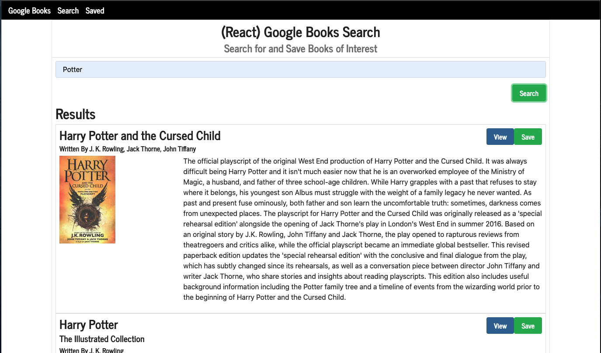

# Google Book Search and Save

## Description
Allows you to search Google's Books API and view and save books to a list of favorites

<a href="https://react-google-books-wh.herokuapp.com/">Deployed Application</a>

## Table of Contents
* [Installation](#installation)
* [Usage](#usage)
* [License](#license)
* [Contributing](#contributing)
* [Tests](#tests)
* [Questions](#questions)

## Installation
To install the necessary dependencies, run the following command

`yarn install`

## Usage

You are free to pull down the repo and play with the code

## License
This project is licensed under MIT

## Contributing
In order to contribute, feel free to fork the repo, make your changes, and once ready submit a merge request back into the main repository

## Tests
To run tests, run the following command

`yarn run test`

## Questions
If you have questions about the repo, open an issue or contact me directly at wharrison33@hotmail.com. You can find more of my work at willh33
  